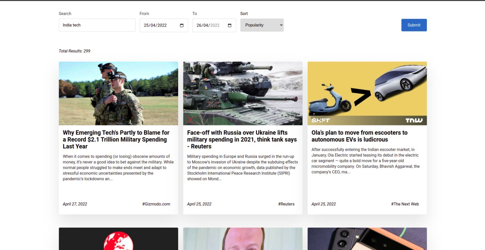

### npm install && npm start

## Features

- Create shareable/bookmark -able links from search form
- Styled components to encapsulate all styles
- Implemented from scratch without library bloat
- Demonstrates React Router
- Lazy Loading on scroll
- Tests for presentational components for now
- TypeScript 100%
- Follows strict multiple js/ts style recommendations
- Max use of components for reusability
- A bit of responsiveness
- Kept UI Simple but fluent

